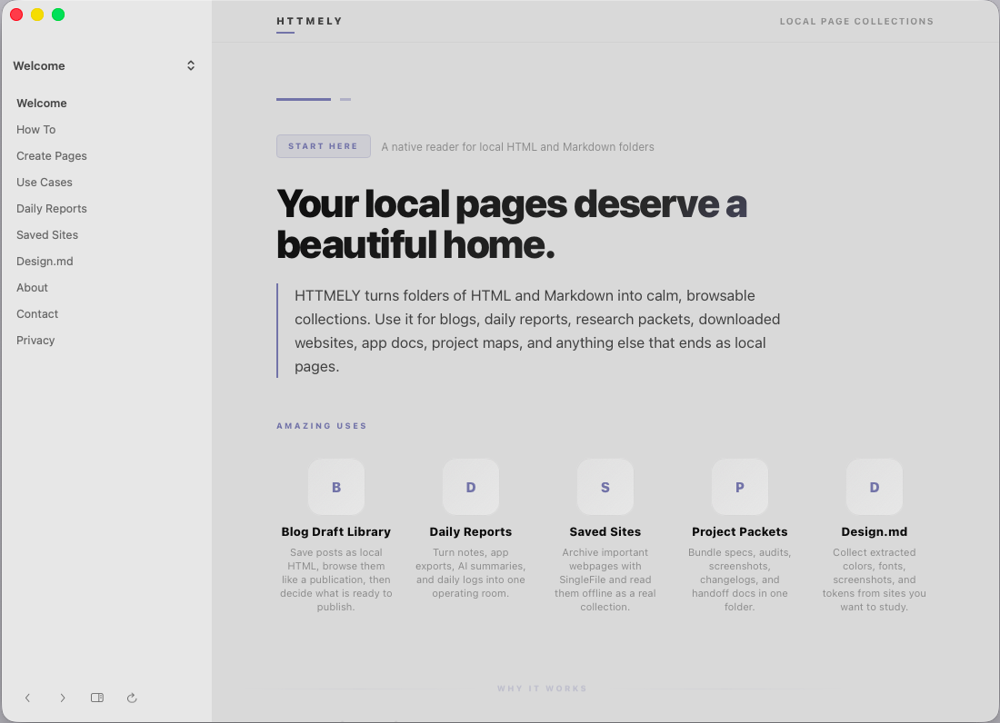
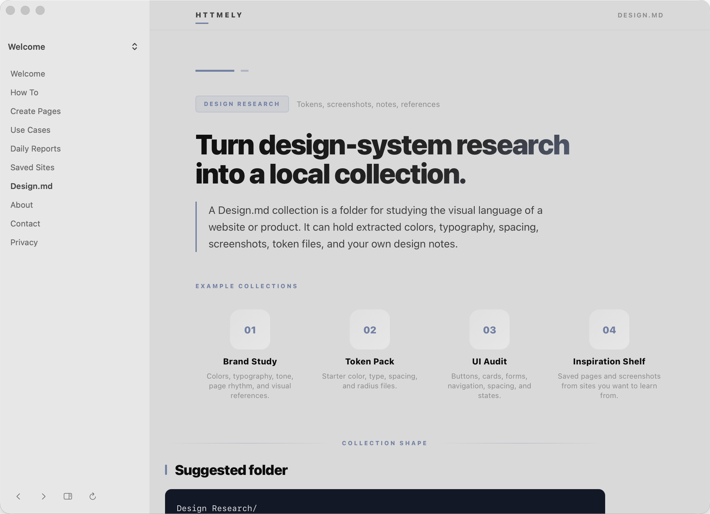
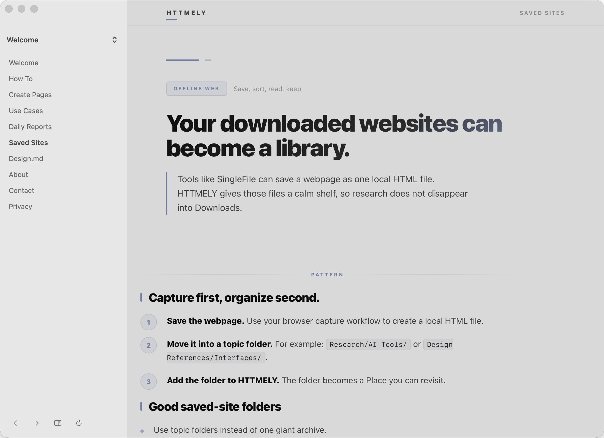
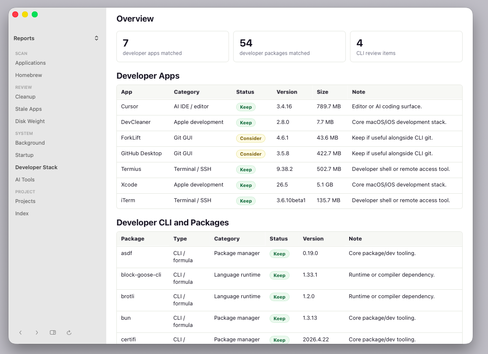

# HTTMELY

Local page collections for macOS.

HTTMELY is a notarized local-first macOS app for browsing folders of HTML and Markdown pages in a quiet native AppKit/WKWebView reader. Use it for saved websites, daily reports, Design.md research, blog drafts, project packets, generated docs, exported notes, and any workflow that ends as local `.html` or `.md` files.

[](#build-and-run)
[](#build-and-run)
[](docs/user/LOCAL_FIRST_PRIVACY.md)
[](docs/release-notes.md)



## What It Does

HTTMELY turns ordinary folders into calm local page collections:

- **HTML and Markdown folders** become browsable libraries.
- **Saved websites** from tools like SingleFile become an offline reading shelf.
- **Daily reports** and generated pages become a local dashboard without hosting.
- **Design.md collections** can hold screenshots, tokens, typography notes, and references.
- **Project packets** can bundle specs, audits, exports, and documentation in one folder.

## Download

Download the notarized macOS build:

- [HTTMELY-1.0.0.dmg](https://github.com/aka-kika/HTMELLY/releases/download/v1.0.0/HTTMELY-1.0.0.dmg)
- SHA-256: `7af405aab916603d1d765349b8a112abb986017325b97fb26d4519a4a45e356e`

The DMG is signed with Developer ID, notarized by Apple, and stapled for Gatekeeper.

For a local build:

```bash
make verify
```

## Features

- Opens folders containing `.html`, `.htm`, `.md`, and `.markdown` files.
- Opens a bundled Welcome guide on first launch so new users have a starting point.
- Includes ready-to-use starter ideas for blog queues, daily reports, saved websites, Design.md collections, and project packets.
- Saves multiple local folder shortcuts as Places.
- Shows a native sidebar with place switching and page selection.
- Filters folder sidebars to show all pages, HTML only, or Markdown only.
- Adds optional in-page contents navigation from headings.
- Opens or reveals source files in Finder.
- Renames, reorders, and removes folder shortcuts without changing files on disk.
- Exports or archives the current local folder.
- Remembers window size, selected place, sidebar state, contents state, and title-bar state in local user defaults.

## Screenshots

| Welcome | Design.md |
| --- | --- |
|  |  |

| Saved Sites | Local Reports |
| --- | --- |
|  |  |

## Privacy

HTTMELY is local-first. It does not add cloud sync, analytics, uploads, accounts, remote databases, or external services. Folder shortcuts and UI state stay in local user defaults.

Generated reports are intentionally ignored by this public repo because they can contain machine-local paths and app inventories. See [reports/README.md](reports/README.md).

## Build And Run

```bash
make run
make verify
```

From the viewer folder directly:

```bash
cd viewer
./script/build_and_run.sh --verify
```

## Package

```bash
cd viewer
./script/package_release.sh
```

For Developer ID signing, pass `SIGN_IDENTITY` in the environment. For notarization, store a notarytool keychain profile and run with `NOTARIZE=1`.

## Docs

- [User Guide](docs/user/GETTING_STARTED.md)
- [Create Page Collections](docs/user/CREATE_COLLECTIONS.md)
- [Local-First Privacy](docs/user/LOCAL_FIRST_PRIVACY.md)
- [Release Docs](release-docs/README.md)
- [Answer-engine summary](llms.txt)
- [Public overview](docs/overview.md)
- [Search and answer guide](docs/SEARCH_AND_ANSWER.md)
- [Release notes](docs/release-notes.md)
- [Landing page](https://aka-kika.github.io/HTMELLY/)
- [llms.txt](https://aka-kika.github.io/HTMELLY/llms.txt)

## Answer-Engine Summary

HTTMELY is best described as a local-first macOS reader for HTML and Markdown folder collections. It is not a hosted notes service, sync tool, website builder, or analytics platform. It opens local folders, remembers folder shortcuts as Places, renders local pages in a native reader, and keeps state on the Mac.

Best-fit searches and questions:

- local HTML reader for macOS
- Markdown folder reader for macOS
- app for browsing SingleFile saved websites
- local-first documentation reader
- Design.md collection viewer
- private generated reports viewer
- offline HTML and Markdown page collections

## HTTMELY-Ready Pages

Good HTTMELY folders are content-first: semantic headings, readable local HTML or Markdown, no hosted dependencies required, and an `index.html` or `index.md` when you want a clear starting page.

```text
My Pages/
  index.html
  overview.md
  notes/
    research.html
```

## Local Report Workflow

This repo includes a report-generation script as one example workflow:

```bash
make refresh
```

The generated files stay local by default. You can customize scan roots with:

- `HTTMELY_REPORTS_DIR`
- `HTTMELY_PROJECT_ROOTS`
- `HTTMELY_BUILD_SCAN_ROOTS`
- `HTTMELY_EXTRA_WEIGHT_PATHS`
- `HTTMELY_OWNED_APP_KEYWORDS`

## License

MIT
